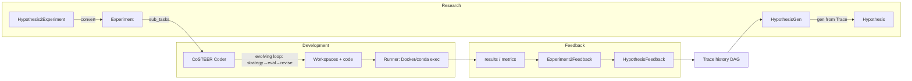
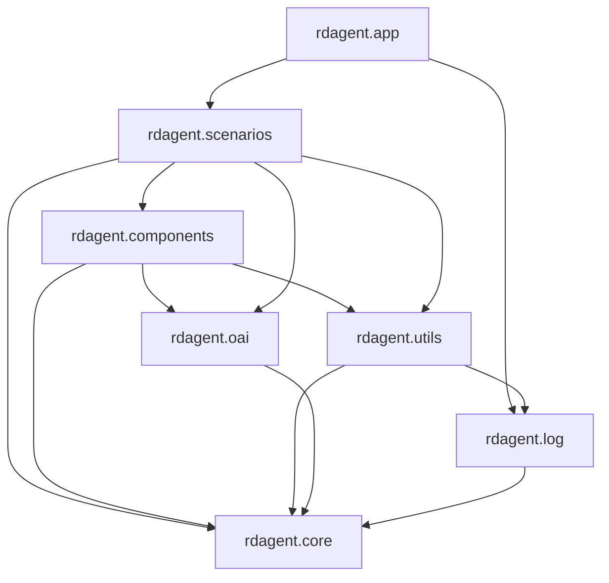

# System Architecture

This article describes how the pieces of RD-Agent fit together: the layered module structure, the R&D loop that drives every scenario, and the data objects that flow through it.

## Layered Architecture

```
┌─────────────────────────────────────────────────────────────────────┐
│  Applications (rdagent/app)                                          │
│  CLI (typer) + per-scenario launchers: fin_factor, fin_model,        │
│  fin_quant, data_science, llm_finetune, general_model, ui, server_ui │
├─────────────────────────────────────────────────────────────────────┤
│  Scenarios (rdagent/scenarios)                                       │
│  data_science (MLE-bench/Kaggle) · qlib (fin quant) · kaggle ·       │
│  finetune (LLM/DS) · general_model · rl                              │
│  Each provides: Scenario, Experiment, HypothesisGen, Coder, Runner,  │
│  Summarizer(Experiment2Feedback), and a concrete RDLoop subclass     │
├─────────────────────────────────────────────────────────────────────┤
│  Components (rdagent/components)                                     │
│  workflow/rd_loop (RDLoop) · coder/CoSTEER (evolving coder) ·        │
│  proposal · runner · loader · benchmark · knowledge_management ·     │
│  agent integrations (MCP / RAG / context7) · document_reader         │
├─────────────────────────────────────────────────────────────────────┤
│  Core (rdagent/core)                                                 │
│  Experiment/Task/Workspace · Hypothesis/Feedback/Trace · Scenario ·  │
│  Developer · evolving framework · KnowledgeBase · Prompts            │
├─────────────────────────────────────────────────────────────────────┤
│  Infrastructure                                                      │
│  utils/workflow (LoopBase engine) · utils/env (Docker/conda exec) ·  │
│  oai (LLM backends) · log (tracing + UIs + Flask server)             │
└─────────────────────────────────────────────────────────────────────┘
```

Dependency direction is strictly downward: scenarios configure components and core with concrete classes; core never imports scenarios.

## The R&D Loop (runtime model)

Every scenario is an instance of a [`LoopBase`](../../../../rdagent/utils/workflow/loop.py) subclass. The canonical loop is [`RDLoop`](../../../../rdagent/components/workflow/rd_loop.py) with these steps:

```
direct_exp_gen ──► coding ──► running ──► feedback ──► record
      │                │          │            │           │
 HypothesisGen     Developer   Developer   Experiment2   Trace
 + Hypothesis2     (CoSTEER    (runs exp   Feedback      records
 Experiment        evolves     in Docker/  summarizes    (exp, fb)
 (proposes idea,   code)       conda env)  results into  into the
 builds tasks)                             Hypothesis    history DAG
                                           Feedback
```

- `direct_exp_gen` = `_propose` + `_exp_gen`: generate a `Hypothesis` from the current `Trace`, then convert it into an `Experiment` of sub-tasks. Optional user-interaction hooks (`_interact_hypo`, `_interact_feedback`) let a human revise hypothesis/feedback via the Flask server IPC queues.
- `coding`: a `Developer` (typically a CoSTEER-based coder) implements the tasks into code inside workspaces.
- `running`: a runner `Developer` executes the experiment in an isolated env (Docker by default).
- `feedback`: `Experiment2Feedback.generate_feedback` turns results into a `HypothesisFeedback` (acceptable / needs-revision with reasons).
- `record`: appends `(experiment, feedback)` to the `Trace` (DAG of history) — must be the last step and is always serialized (parallelism of `feedback`/`record` is forced to 1).

The loop supports **skip** (`skip_loop_error` → jump to feedback/record) and **withdraw** (`withdraw_loop_error` → roll back to previous session) semantics, used e.g. by the data science loop on `CoderError`/`RunnerError`/`PolicyError`.

## Core Data Flow



Key objects (defined in [`rdagent/core`](../../../../rdagent/core), see [Core Abstractions](03-core-abstractions.md)):

- `Hypothesis` — the proposed idea (with confidence/reason); produced each loop by `HypothesisGen.gen(trace, plan)`.
- `Experiment` — a sequence of `Task`s plus their implementations (`sub_workspace_list`) and an overall `experiment_workspace`.
- `Workspace` / `FBWorkspace` — file-based implementation containers with checkpoints (`create_ws_ckp` / `recover_ws_ckp`).
- `Trace` — the scenario's memory: history of experiments & feedback, DAG parent links, current hypothesis.
- `Scenario` — describes the domain (rich description, output format, interface) consumed by prompt generation.

## Execution Environments

Code produced by coders never runs in the main process. [`rdagent/utils/env.py`](../../../../rdagent/utils/env.py) provides a generic `Env[EnvConf]` abstraction:

- `DockerConf` / `Env` — default; runs code in disposable containers with volume mounts, timeout handling, image pull with progress.
- `LocalConf` / `LocalEnv`, `CondaConf` — direct execution (e.g. Qlib scenarios use `QlibCondaConf`/`QlibCondaEnv`; MLE-bench uses `MLECondaConf`).

Results come back as `EnvResult` (stdout/stderr/exit code), feeding the runner's feedback.

## Observability

Everything important is logged through the singleton [`RDAgentLog`](../../../../rdagent/log/logger.py) (`rdagent.log.rdagent_logger`):

- `logger.log_object(obj, tag=...)` — pickles objects into the trace directory under hierarchical tags (`Loop_{i}.{step}...`).
- `logger.tag(...)` context manager — thread/coroutine-safe tag nesting.
- Session snapshots from `LoopBase.dump` under `<trace_path>/__session__/{loop_idx}/{step_idx}_{name}` enable resume/checkout.
- UIs: Streamlit (`rdagent ui`) reads traces offline; the Flask server (`rdagent server_ui`) serves live runs and the Vue frontend in [`web/`](../../../../web). Details in [Logging, Tracing & UI](07-logging-tracing-and-ui.md).

## Module Dependency Map (simplified)



- `core` is dependency-free of the rest (scenario-agnostic contracts).
- `utils.workflow` hosts the loop engine used by every scenario.
- `oai` is the only module talking to LLM providers; components access it through `APIBackend`.
- `log` is used by all layers; `loop.py` and scenario code emit tagged traces.
